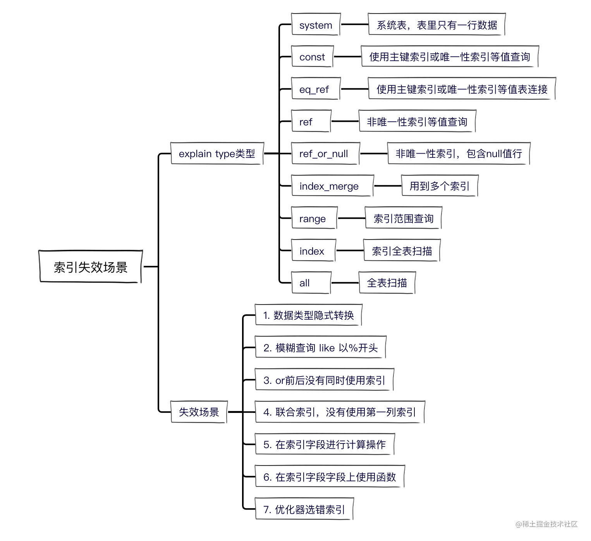

# SQL

### Mysql索引失效原因



### 查询慢sql日志 
```
SHOW VARIABLES LIKE 'slow_query%';
docker exec -it mysql bash
tail -2000 mysql_slow.log
/var/lib/mysql/mysql-bin
```

## 命令行

### 操作数据流
```aidl
//备份
mysqldump -u用户名 -p密码 数据库名称 > 备份的路径\备份的文件名.sql
// 删除
drop database 数据库名称;
// 创建
create database 数据库名称;
// 导入
source 备份的路径\备份的文件名.sql
```


### sql解析身份证

**mysql**

```sql
# 身份证号码
# 1.出生年月日：截取从第7位开始，截取8位
# 2.年龄：当前年-出生年的结果
# 3.性别：截取从第17位开始，截取1位，截取的结果/2，如果为1，为男，否则为女
SELECT author_id "身份证号",
SUBSTR(author_id,7,8),
date_format(SUBSTR(author_id,7,8),"%Y-%m-%d") "出生日期",
YEAR(NOW())-YEAR(SUBSTR(author_id,7,8)) "年龄",
IF(MOD(SUBSTR(author_id,17,1),2),"男","女") "性别"
FROM `mto_comment`;
```

**oracle**

```sql
SELECT
	sa.BID "身份证号",
	SUBSTR( sa.BID, 7, 8 ),
	TO_DATE( SUBSTR( sa.BID, 7, 8 ), 'YYYY/MM/DD' ) "出生年月日",
	CASE WHEN SUBSTR( sa.BID, 17, 1 ) IN ( '1', '3', '5', '7', '9' ) THEN '男'
		 WHEN SUBSTR( sa.BID, 17, 1 ) IN ( '0', '2', '4', '6', '8' ) THEN '女'
		 END 性别
FROM
	API_SAFETY_ALLOWIP sa;
```

#### MySQL生成36位、32位UUID以及32位大写的UUID

```sql
SELECT UUID() AS `36位UUID`, REPLACE(UUID(),'-','') AS `32位UUID`, UPPER(REPLACE(UUID(),'-','')) AS `32位大写UUID`;
```


#### 批量修改表名前缀
```sql
# 查询分隔符位置
select LOCATE('_' ,'mto_post_attribute' );

# 会生成修改sql
Select CONCAT( 'ALTER TABLE ', table_name,' RENAME TO ', 'cms',SubString(table_name,4),';' )
FROM information_schema.tables
Where table_name LIKE 'mto_%';


每一个好习惯都是一笔财富，本文分 SQL 后悔药、SQL 性能优化、SQL 规范优雅三个方向，分享写 SQL 的 21 个好习惯。


#### 1. 写完 SQL 先 explain 查看执行计划。【SQL 性能优化】

日常开发写 SQL 的时候，尽量养成这个好习惯呀：写完 SQL 后，用 explain 分析一下，尤其注意走不走索引。

```sql
explain select userid,name,age from user 
where userid =10086 or age =18;
```


#### 2. 操作 delete 或者 update 语句，加个 limit。【SQL 后悔药】

在执行删除或者更新语句时，尽量加上 limit，以下面的这条 SQL 为例吧：

```sql
delete from euser where age > 30 limit 200;
```

因为加了 limit 主要有这些好处：

- **「降低写错 SQL 的代价」**, 你在命令行执行这个 SQL 的时候，如果不加 limit，执行的时候一个**「不小心手抖」**，可能数据全删掉了，如果**「删错」**了呢？加了 limit 200，就不一样了。删错也只是丢失 200 条数据，可以通过 binlog 日志快速恢复的。
- **「SQL 效率很可能更高」**，你在 SQL 行中，加了 limit 1，如果第一条就命中目标 return， 没有 limit 的话，还会继续执行扫描表。
- **「避免了长事务」**，delete 执行时，如果 age 加了索引，MySQL 会将所有相关的行加写锁和间隙锁，所有执行相关行会被锁住，如果删除数量大，会直接影响相关业务无法使用。
- **「数据量大的话，容易把 CPU 打满」** ,如果你删除数据量很大时，不加 limit 限制一下记录数，容易把 CPU 打满，导致越删越慢的。


#### 3. 设计表的时候，所有表和字段都添加相应的注释。【SQL 规范优雅】

这个好习惯一定要养成啦，设计数据库表的时候，所有表和字段都添加相应的注释，后面更容易维护。

**「正例：」**

```sql
CREATE TABLE `account` (
  `id` int(11) NOT NULL AUTO_INCREMENT COMMENT '主键Id',
  `name` varchar(255) DEFAULT NULL COMMENT '账户名',
  `balance` int(11) DEFAULT NULL COMMENT '余额',
  `create_time` datetime NOT NULL COMMENT '创建时间',
  `update_time` datetime NOT NULL ON UPDATE CURRENT_TIMESTAMP COMMENT '更新时间',
  PRIMARY KEY (`id`),
  KEY `idx_name` (`name`) USING BTREE
) ENGINE=InnoDB AUTO_INCREMENT=1570068 DEFAULT CHARSET=utf8 ROW_FORMAT=REDUNDANT COMMENT='账户表';
```

**「反例：」**

```sql
CREATE TABLE `account` (
  `id` int(11) NOT NULL AUTO_INCREMENT,
  `name` varchar(255) DEFAULT NULL,
  `balance` int(11) DEFAULT NULL,
  `create_time` datetime NOT NULL ,
  `update_time` datetime NOT NULL ON UPDATE CURRENT_TIMESTAMP,
  PRIMARY KEY (`id`),
  KEY `idx_name` (`name`) USING BTREE
) ENGINE=InnoDB AUTO_INCREMENT=1570068 DEFAULT CHARSET=utf8;
```


#### 4. SQL 书写格式，关键字大小保持一致，使用缩进。【SQL 规范优雅】

**「正例：」**

```sql
SELECT stu.name, sum(stu.score)
FROM Student stu
WHERE stu.classNo = '1班'
GROUP BY stu.name
```

**「反例：」**

```sql
SELECT stu.name, sum(stu.score) from Student stu WHERE stu.classNo = '1班' group by stu.name.
```

显然，统一关键字大小写一致，使用缩进对齐，会使你的 SQL 看起来更优雅~


#### 5. INSERT 语句标明对应的字段名称。【SQL 规范优雅】

**「反例：」**

```sql
insert into Student values ('666','捡田螺的小男孩','100');
```

**「正例：」**

```sql
insert into Student(student_id,name,score) values ('666','捡田螺的小男孩','100');
```


#### 6. 变更 SQL 操作先在测试环境执行，写明详细的操作步骤以及回滚方案，并在上生产前 review。【SQL 后悔药】

- 变更 SQL 操作先在测试环境测试，避免有语法错误就放到生产上了。
- 变更 SQL 操作需要写明详细操作步骤，尤其有依赖关系的时候，如：先修改表结构再补充对应的数据。
- 变更 SQL 操作要有回滚方案，并在上生产前，review 对应变更 SQL。


#### 7. 设计数据库表的时候，加上三个字段：主键、create_time、update_time。【SQL 规范优雅】

**「反例：」**

```sql
CREATE TABLE `account` (
  `name` varchar(255) DEFAULT NULL COMMENT '账户名',
  `balance` int(11) DEFAULT NULL COMMENT '余额',
) ENGINE=InnoDB AUTO_INCREMENT=1570068 DEFAULT CHARSET=utf8 ROW_FORMAT=REDUNDANT COMMENT='账户表';
```

**「正例：」**

```sql
CREATE TABLE `account` (
  `id` int(11) NOT NULL AUTO_INCREMENT COMMENT '主键Id',
  `name` varchar(255) DEFAULT NULL COMMENT '账户名',
  `balance` int(11) DEFAULT NULL COMMENT '余额',
  `create_time` datetime NOT NULL COMMENT '创建时间',
  `update_time` datetime NOT NULL ON UPDATE CURRENT_TIMESTAMP COMMENT '更新时间',
  PRIMARY KEY (`id`),
  KEY `idx_name` (`name`) USING BTREE
) ENGINE=InnoDB AUTO_INCREMENT=1570068 DEFAULT CHARSET=utf8 ROW_FORMAT=REDUNDANT COMMENT='账户表';
```

**「理由：」**

- 主键一般都要加上的，没有主键的表是没有灵魂的。
- 创建时间和更新时间的话，还是建议加上吧，详细审计、跟踪记录，都是有用的。


#### 8. 写完 SQL 语句，检查 where、order by、group by 后面的列，多表关联的列是否已加索引，优先考虑组合索引。【SQL 性能优化】

**「反例：」**

```sql
select * from user 
where address ='深圳' order by age;
```


**「正例：」**

```
添加索引
alter table user add index idx_address_age (address,age)
```


#### 9. 修改或删除重要数据前，要先备份，先备份，先备份。【SQL 后悔药】

如果要修改或删除数据，在执行 SQL 前一定要先备份要修改的数据，万一误操作，还能吃口**「后悔药」**~


#### 10. where 后面的字段，留意其数据类型的隐式转换。【SQL 性能优化】

**「反例：」**

```sql
//userid 是varchar字符串类型
select * from user where userid =123;
```


**「正例：」**

```sql
select * from user where userid ='123';
```


**「理由：」**

- 因为不加单引号时，是字符串跟数字的比较，它们类型不匹配，MySQL 会做隐式的类型转换，把它们转换为浮点数再做比较，最后导致索引失效。


#### 11. 尽量把所有列定义为 NOT NULL。【SQL 规范优雅】

- **「NOT NULL 列更节省空间」**，NULL 列需要一个额外字节作为判断是否为 NULL 的标志位。
- **「NULL 列需要注意空指针问题」**，NULL 列在计算和比较的时候，需要注意空指针问题。


#### 12. 修改或者删除 SQL，先写 WHERE 查一下，确认后再补充 delete 或 update。【SQL 后悔药】

尤其在操作生产的数据时，遇到修改或者删除的 SQL，先加个 where 查询一下，确认 OK 之后，再执行 update 或者 delete 操作。


#### 13. 减少不必要的字段返回，如使用 select <具体字段> 代替 select *。【SQL 性能优化】

**「反例：」**

```sql
select * from employee;
```

**「正例：」**

```sql
select id，name from employee;
```

**「理由：」**

- 节省资源，减少网络开销。
- 可能用到覆盖索引，减少回表，提高查询效率。


#### 14. 所有表必须使用 Innodb 存储引擎。【SQL 规范优雅】

Innodb **「支持事务，支持行级锁，更好的恢复性」**，高并发下性能更好，所以呢，没有特殊要求（即 Innodb 无法满足的功能如：列存储，存储空间数据等）的情况下，所有表必须使用 Innodb 存储引擎。


#### 15. 数据库和表的字符集尽量统一使用 UTF8。【SQL 规范优雅】

尽量统一使用 UTF8 编码。

- 可以避免乱码问题。
- 可以避免不同字符集比较转换所导致的索引失效问题。

**「如果需要存储表情，那么选择 utf8mb4 来进行存储，注意它与 utf-8 编码的区别。」**


#### 16. 尽量使用 varchar 代替 char。【SQL 性能优化】

**「反例：」**

```sql
  `deptName` char(100) DEFAULT NULL COMMENT '部门名称'
```

**「正例：」**

```sql
`deptName` varchar(100) DEFAULT NULL COMMENT '部门名称'
```

**「理由：」**

- 因为首先变长字段存储空间小，可以节省存储空间。


#### 17. 如果修改字段含义或对字段表示的状态追加时，需要及时更新字段注释。【SQL 规范优雅】

你的字段，尤其是表示枚举状态时，如果含义被修改了，或者状态追加时，为了后面更好维护，需要及时更新字段的注释。


#### 18. SQL 命令行修改数据，养成 begin + commit 事务的习惯。【SQL 后悔药】

**「正例：」**

```sql
begin;
update account set balance =1000000
where name ='捡田螺的小男孩';
commit;
```

**「反例：」**

```sql
update account set balance =1000000
where name ='捡田螺的小男孩';
```


#### 19. 索引命名要规范，主键索引名为 pk_ 字段名；唯一索引名为 uk _字段名 ；普通索引名则为 idx _字段名。【SQL 规范优雅】

说明：pk_ 即 primary key；uk_ 即 unique key；idx_ 即 index 的简称。


#### 20. WHERE 从句中不对列进行函数转换和表达式计算。【SQL 性能优化】

假设 loginTime 加了索引。

**「反例：」**

```sql
select userId,loginTime 
from loginuser
where Date_ADD(loginTime,Interval 7 DAY) >=now();
```

**「正例：」**

```sql
explain  select userId,loginTime 
from loginuser 
where  loginTime >= Date_ADD(NOW(),INTERVAL - 7 DAY);
```

**「理由：」**

- 索引列上使用 MySQL 的内置函数，索引失效。


#### 21. 如果修改/更新数据过多，考虑批量进行。【SQL 性能优化】

**「反例：」**

```
delete from account  limit 100000;
```

**「正例：」**

```
for each(200次)
{
 delete from account  limit 500;
}
```

**「理由：」**

- 大批量操作会造成主从延迟。
- 大批量操作会产生大事务，阻塞。
- 大批量操作，数据量过大，会把 CPU 打满。