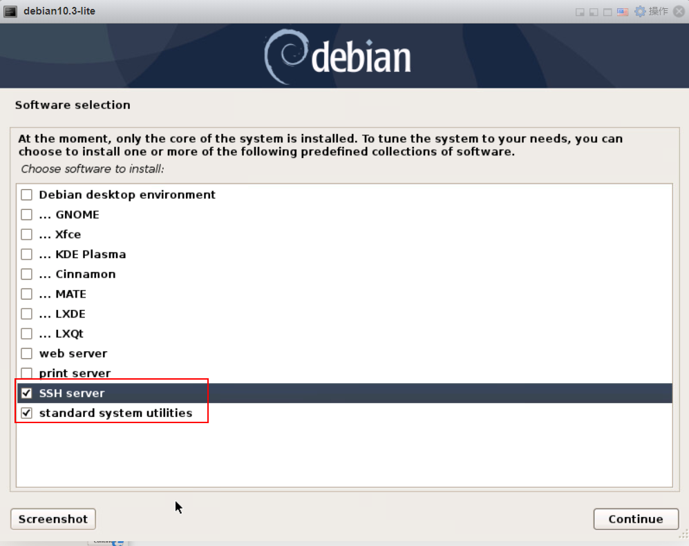
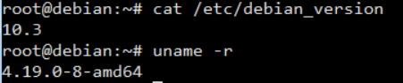
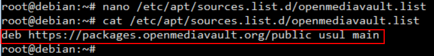
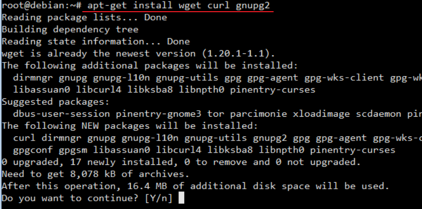
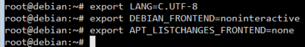
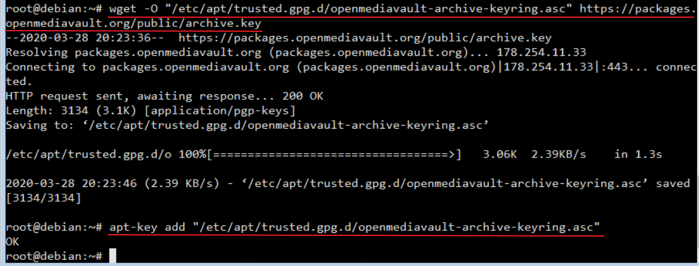
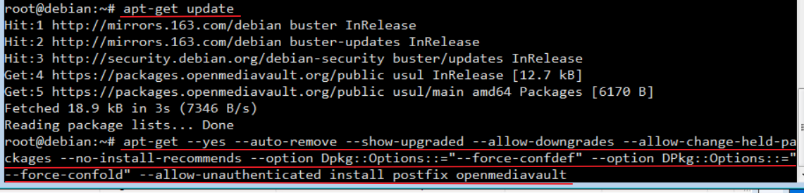
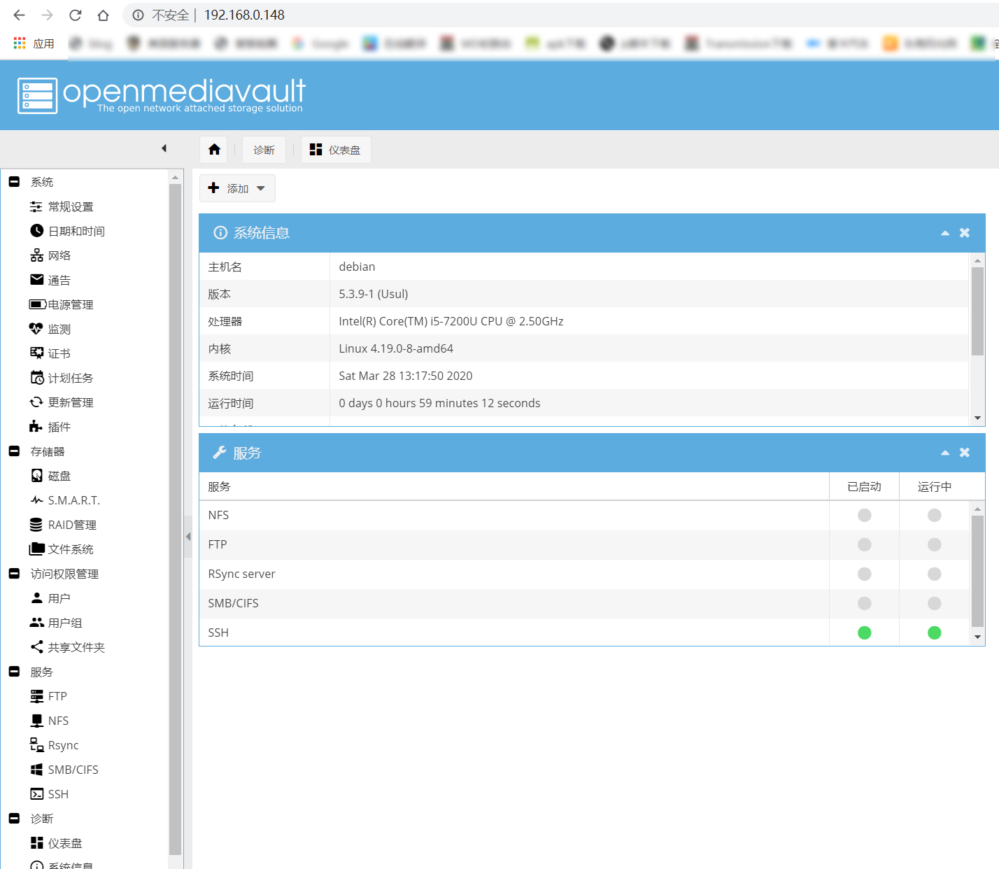
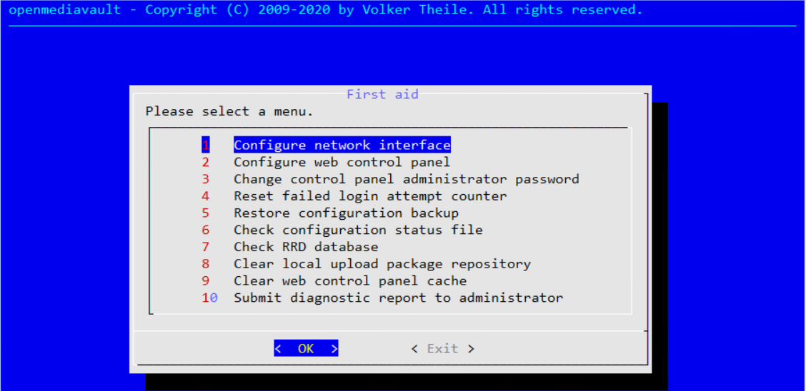

## Debian 安装


## 默认配置

### 权限配置

```bash
su root
apt install sudo 
apt install vim
vim /etc/sudoers  #在 /etc/sudoers 文件添加一行内容

> 
wlg   ALL=(ALL) ALL
>

su wlg
```


### 修改主机名

```bash
hostnamectl  #查看主机名

hostnamectl set-hostname [txy]  #设置主机名
vim /etc/host  #修改配置
>
127.0.0.1 localhost.localdomain [txy]
>
```


### 软件源

- 国内常用源：

- - 163 源：http://mirrors.163.com/.help/debian.html
  - 阿里源：http://mirrors.aliyun.com/help/debian
  - sohu：[http://mirrors.sohu.com/help/debian.html](http://mirrors.sohu.com/help/ubuntu.html)

```bash
cp /etc/apt/sources.list /etc/apt/sources-20200104.list  #备份
vim /etc/apt/sources.list  #打开配置文件，替换里面所有内容为下面这些内容

>
#163
deb http://mirrors.163.com/debian/ buster main non-free contrib
deb-src http://mirrors.163.com/debian/ buster main non-free contrib
deb http://mirrors.163.com/debian-security buster/updates main
deb-src http://mirrors.163.com/debian-security buster/updates main
deb http://mirrors.163.com/debian/ buster-updates main non-free contrib
deb-src http://mirrors.163.com/debian/ buster-updates main non-free contrib
deb http://mirrors.163.com/debian/ buster-backports main non-free contrib
deb-src http://mirrors.163.com/debian/ buster-backports main non-free contrib
>

apt clean all 
apt update
apt upgrade
apt dist-upgrade
```


### 修改语言

```bash
sudo dpkg-reconfigure locales  #添加中文编码 zh-utf-8 ，工具为添加字符支持

sudo vim /etc/default/locale  #修改配置文件
>
LANG="en_US.UTF-8"
LANGUAGE="en_US:en"
>
```


### 配置IP

```bash
ip addr  #查看网卡信息

sudo vim /etc/network/interfaces  #编辑网络配置文件
>
auto eth0  #网卡名称
# iface eth0 inet dhcp # 注释上面默认配置的DHCP设置,改为下面这个static
iface eth0 inet static 
address 192.168.1.103 # IP 地址
netmask 255.255.255.0 # 子网掩码
gateway 192.168.1.1 # 网关
>

sudo vim /etc/resolvconf/resolv.conf.d/base  #修改DNS
>
nameserver = 114.114.114.114 //DNS1
nameserver = 8.8.8.8  //DNS2
>

sudo resolvconf -u  #更新 resolv.conf 文件
#重启服务
sudo /etc/init.d/networking restart || sudo systemctl restart networking.service
```

**有线实例**

```bash
sudo vim /etc/network/interfaces

>
auto eth0 #开机自动连接网络
iface lo inet loopback
allow-hotplug eth0
iface eth0 inet static #static表示使用固定ip，dhcp表述使用动态ip
address 10.10.10.155 #设置ip地址
netmask 255.255.255.0 #设置子网掩码
gateway 10.10.10.2 #设置网关

broadcase 10.10.10.255#设置广播地址（也可以不写）
>

sudo vim /etc/resolv.conf

>
nameserver 10.10.10.2 #设置首选dns
nameserver 114.114.114.114 #设置备用dns
>
```

**WiFI实例**

```bash
sudo vim /etc/network/interfaces

>
auto wlan0
iface wlan0 inet static
address 192.168.5.155
netmask 255.255.255.0
gateway 192.168.5.1
pre-up ip link set wlan0 up
pre-up iwconfig wlan0 essid ssid
wpa-ssid wz
wpa-psk wz888888
>
```


### 安装无线网卡

```bash
sudo apt install firmware-iwlwifi
su root
modprobe -r iwlwifi
modprobe iwlwifi
```


### 系统备份

```bash
# 编辑备份脚本
echo '
#!/bin/bash
sudo tar -cvpzf /media/zhanjzh/zhanjzh/ubuntu_backup@`date +%Y-%m+%d`.tar.gz --exclude=/proc --exclude=/tmp --exclude=/boot --exclude=/home --exclude=/lost+found --exclude=/media --exclude=/mnt --exclude=/run /
sudo tar -cvpzf /media/zhanjzh/zhanjzh/ubuntu_boot_backup@`date +%Y-%m-%d`.tar.gz /boot
sudo tar -cvpzf /media/zhanjzh/zhanjzh/ubuntu_home_backup@`date +%Y-%m-%d`.tar.gz /home
' >> backup.sh
```


### SWAP 分区

**1、添加SWAP分区**

```bash
# 查看当前 SWAP 情况
free -m
# 创建 SWAP 文件**，设置大小，这里我设置为 8G。（bs * count = SWAP 大小）
sudo dd if=/dev/zero of=/var/swap bs=8M count=1024
# 设置文件权限
sudo chmod 600 /var/swap 
# 创建 SWAP
sudo mkswap /var/swap
# 启用
sudo swapon /var/swap
# 查看 SWAP 状态
swapon -s | free -m
# 添加开机启动,在 /etc/fstab 中添加一行 /var/swap swap swap default 0 0
echo '/var/swap swap swap default 0 0' >> /etc/fstab
```

**2、删除SWAP分区**

```bash
# 首先要停用
swapoff /var/swap
# 然后再删除
rm -rf /var/swap
# 最后去掉开机启动
sed -i '/\/var\/swap swap swap default 0 0/d' /etc/fstab
```

SWAP 文件大小的设置，当然并不是设置的虚拟内存越大就越好，按需要设置，最大不要超过物理内存的 2 倍。

物理内存 ≤ 1G 时，设置 SWAP 为内存的 2 倍大小；8G ＞ 物理内存 ＞ 1G 时，设置 SWAP 为内存的 1.5 倍大小。


## 软件配置

### SSH安装

```bash
sudo apt install ssh
vim /etc/sshd_config  #配置
>
#取消注释读写操作
write_enable=yes
>

service ssh status  #刷新配置
service ssh start
```

SSH登录异常的解决方法：REMOTE HOST IDENTIFICATION HAS CHANGED!

```bash
# 删除中间服务器上的认证信息就行
ssh-keygen -R 服务器的IP
```


### FTP安装

```bash
# 安装命令
apt install vsftpd

# 启动命令
sudo service vsftpd status
sudo service vsftpd restart

# 修改配置
vim /etc/vsftpd.conf
>

>
```


### unzip安装

```bash
# 安装命令
apt install unzip

# 解压命令
unzip -d xxx.zip  //解压zip

# tar格式命令
tar -czvf xxx.tar.gz xxx  //压缩
tar -tzvf xxx.tar.gz  //列出压缩文件内容
tar -xzvf xxx.tar.gz  //解压文件
```


### wget安装

```bash
# 安装命令
apt install wget

#整站克隆/仿站
wget -r -p -np -k www.avatrade.cn
```

**参数说明：**

```
-r --recursive（递归） specify recursive download.（指定递归下载）
-k --convert-links（转换链接） make links in downloaded HTML point to local files.（将下载的HTML页面中的链接转换为相对链接即本地链接）
-p --page-requisites（页面必需元素） get all images, etc. needed to display HTML page.（下载所有的图片等页面显示所需的内容）
-np --no-parent（不追溯至父级） don't ascend to the parent directory.

这里写代码片额外参数：
-nc  断点续传
-o   生成日志文件
```


### Google中文拼音输入法

```bash
#添加中文编码 zh-utf-8
sudo dpkg-reconfigure locales
sudo apt-get install fcitx-googlepinyin
```


### Typora安装

```bash
wget -qO - https://typora.io/linux/public-key.asc | sudo apt-key add -
sudo add-apt-repository 'deb https://typora.io/linux ./'
sudo apt-get update
sudo apt-get install typora
```


### 坚果云

```bash
sudo dpkg -i nautilus_nutstore_amd64.deb
sudo apt-get install -f
```


### Git


```bash
sudo apt-get install git
git --version
```


### Java

```bash
tar -zxvf jdk-linux-x64.tar.gz -C /WLG/Soft/Path/jdk8
sudo vim /etc/profile 
>
export JAVA_HOME=/WLG/Soft/Path/jdk8
export CLASSPATH=.:$CLASSPATH:$JAVA_HOME/lib
export PATH=$PATH:$JAVA_HOME/bin
>
source /etc/profile
java -version
```


### Nodejs

```bash
wget https://nodejs.org/dist/v10.16.0/node-v10.16.0-linux-x64.tar.xz
sudo tar -zxvf node-v10.16.0-linux-x64.tar.xz /opt/path/node@10.16
sudo gedit /etc/profile
>
export NODEJS_HOME=/WLG/Soft/Path/node12.16.3
export PATH=$PATH:$NODEJS_HOME/bin
>
source /etc/profile
node --version

#npm镜像  
npm install --registry=https://registry.npm.taobao.org
```


### Tomcat

```bash
wget http://mirror.bit.edu.cn/apache/tomcat/tomcat-9/v9.0.20/bin/apache-tomcat-9.0.20.tar.gz
tar -zxvf apache-tomcat-9.0.20.tar.gz /opt/path/tomcat@9.0
sudo gedit /etc/profile
>
export TOMCAT_HOME=/opt/apache/tomcat@9.0
export PATH=$PATH:$TOMCAT_HOME/bin
>
source /etc/profile

//配置UTF-8字符集，找到 port="8080"，在里面添加
sudo gedit /opt/apache/tomcat@9.0/conf/server.xml 
>
URIEncoding="UTF-8"
>
```


### Maven

```bash
sudo mv apache-maven-3.5 /opt/path/maven@3.5
sudo gedit /etc/profile
>
export MAVEN_HOME=/WLG/Soft/Path/maven3.6.3
export PATH=$PATH:$MAVEN_HOME/bin
>
source /etc/profile
mvn -version

```


**修改配置文件**

```bash
vim /
# 本地仓库位置修改，`<localRepository>`标签内添加自己的本地位置路径
>
<localRepository>/WLG/Soft/Path/maven3/local-repo</localRepository>
>
# 添加国内镜像源,标签下`<mirror>`，添加国内镜像源
>
<!-- 阿里云仓库 -->
<mirror>
    <id>nexus-aliyun</id>
    <mirrorOf>central</mirrorOf> 
    <name>Nexus aliyun</name>
    <url>http://maven.aliyun.com/nexus/content/groups/public</url>
</mirror>

<!-- 中央仓库 -->
<mirror>
    <id>repo1</id>
    <mirrorOf>central</mirrorOf>
    <name>Human Readable Name for this Mirror.</name>
    <url>http://repo1.maven.org/maven2/</url>
</mirror>
>

# 修改maven默认的JDK版本,在`<profiles>`标签下添加一个`<profile>`标签，修改maven默认的JDK版本
>
<profile>     
    <id>JDK-1.8</id>       
    <activation>       
        <activeByDefault>true</activeByDefault>       
        <jdk>1.8</jdk>       
    </activation>       
    <properties>       
        <maven.compiler.source>1.8</maven.compiler.source>       
        <maven.compiler.target>1.8</maven.compiler.target>       
        <maven.compiler.compilerVersion>1.8</maven.compiler.compilerVersion>       
    </properties>       
</profile>
>
```


**Maven常用命令**

```
清除命令 ： mvn clean
编译命令 ： mvn compile
打包命令 ： mvn package
跳过单元测试 ： mvn clean package -Dmaven.test.skip=true
```


### Nginx安装

```bash
#命令安装
apt install nginx  

# 设置开机启动
sudo systemctl disable nginx  //禁止
sudo systemctl enable nginx  //允许
```

默认配置文件路径: `/etc/nginx/sites-enabled/default`

默认nginx配置文件路径: `/etc/nginx/nginx.conf`

**实例配置**

```bash
mkdir -p /home/code/whtml/wh-nav
chmod -R 755 /home/code/whtml/wh-nav
vim /etc/nginx/sites-available/nav.wulgs.com
>
server {
      listen 80;
      server_name nav.wulgs.com;
      root /home/code/whtml/wh-nav;
      
      location / {
              index index.html index.htm;
      }
}
>

ln -s /etc/nginx/sites-available/nav.wulgs.com /etc/nginx/sites-enabled/
nginx -t
systemctl restart nginx


sudo gedit /etc/hosts  #配置本地域名
>
127.0.0.1 wo.com
>
```


**Nginx常用命令**

```
查看进程命令: ps -ef|grep nignx
测试配置文件: sudo nginx -t
启动命令: sudo systemctl start nginx
停止命令: sudo systemctl stop nginx
重启命令: sudo systemctl restart nginx
重载配置: sudo systemctl reload nginx
平滑重启: kill -HUP [nginx的主进程号：PID]
```


**配置nginx局域网内可访问**

```
#本机
server {
        listen       80;
        server_name  www.stat.me ;
        root   "E:/lein/rkts/rkts/code/stat/public";
        
        autoindex off;

        location / {
          index  index.html index.htm index.php;
          #try_files $uri $uri/ /server.php?/$uri;
          try_files $uri $uri/ /index.php?$query_string;
        }

        location ~ \.php(.*)$ {
            fastcgi_pass   127.0.0.1:9000;
            fastcgi_index  index.php;
            fastcgi_split_path_info  ^((?U).+\.php)(/?.+)$;
            fastcgi_param  SCRIPT_FILENAME  $document_root$fastcgi_script_name;
            fastcgi_param  PATH_INFO  $fastcgi_path_info;
            fastcgi_param  PATH_TRANSLATED  $document_root$fastcgi_path_info;
            include        fastcgi_params;
        }
}

#供局域网内其他机器访问
server {
        listen       8090;
        server_name  192.168.115.197:8090 ;
        root   "E:/lein/rkts/rkts/code/stat/public";
        
        autoindex off;

        location / {
          index  index.html index.htm index.php;
          #try_files $uri $uri/ /server.php?/$uri;
          try_files $uri $uri/ /index.php?$query_string;
        }

        location ~ \.php(.*)$ {
            fastcgi_pass   127.0.0.1:9000;
            fastcgi_index  index.php;
            fastcgi_split_path_info  ^((?U).+\.php)(/?.+)$;
            fastcgi_param  SCRIPT_FILENAME  $document_root$fastcgi_script_name;
            fastcgi_param  PATH_INFO  $fastcgi_path_info;
            fastcgi_param  PATH_TRANSLATED  $document_root$fastcgi_path_info;
            include        fastcgi_params;
        }
}
```


**nginx.conf中文详解**

```conf
#定义Nginx运行的用户和用户组
user www www;
#nginx进程数，建议设置为等于CPU总核心数。
worker_processes 8;
#全局错误日志定义类型，[ debug | info | notice | warn | error | crit ]
error_log /var/log/nginx/error.log info;
#进程文件
pid /var/run/nginx.pid;
#一个nginx进程打开的最多文件描述符数目，理论值应该是最多打开文件数（系统的值ulimit -n）与nginx进程数相除，但是nginx分配请求并不均匀，所以建议与ulimit -n的值保持一致。
worker_rlimit_nofile 65535;
#工作模式与连接数上限
events
{
    #参考事件模型，use [ kqueue | rtsig | epoll | /dev/poll | select | poll ]; epoll模型是Linux 2.6以上版本内核中的高性能网络I/O模型，如果跑在FreeBSD上面，就用kqueue模型。
    use epoll;
    #单个进程最大连接数（最大连接数=连接数*进程数）
    worker_connections 65535;
}
#设定http服务器
http
{
    include mime.types; #文件扩展名与文件类型映射表
    default_type application/octet-stream; #默认文件类型
    #charset utf-8; #默认编码
    server_names_hash_bucket_size 128; #服务器名字的hash表大小
    client_header_buffer_size 32k; #上传文件大小限制
    large_client_header_buffers 4 64k; #设定请求缓
    client_max_body_size 8m; #设定请求缓
    sendfile on; #开启高效文件传输模式，sendfile指令指定nginx是否调用sendfile函数来输出文件，对于普通应用设为 on，如果用来进行下载等应用磁盘IO重负载应用，可设置为off，以平衡磁盘与网络I/O处理速度，降低系统的负载。注意：如果图片显示不正常把这个改成off。
    autoindex on; #开启目录列表访问，合适下载服务器，默认关闭。
    tcp_nopush on; #防止网络阻塞
    tcp_nodelay on; #防止网络阻塞
    keepalive_timeout 120; #长连接超时时间，单位是秒
    #FastCGI相关参数是为了改善网站的性能：减少资源占用，提高访问速度。下面参数看字面意思都能理解。
    fastcgi_connect_timeout 300;
    fastcgi_send_timeout 300;
    fastcgi_read_timeout 300;
    fastcgi_buffer_size 64k;
    fastcgi_buffers 4 64k;
    fastcgi_busy_buffers_size 128k;
    fastcgi_temp_file_write_size 128k;
    #gzip模块设置
    gzip on; #开启gzip压缩输出
    gzip_min_length 1k; #最小压缩文件大小
    gzip_buffers 4 16k; #压缩缓冲区
    gzip_http_version 1.0; #压缩版本（默认1.1，前端如果是squid2.5请使用1.0）
    gzip_comp_level 2; #压缩等级
    gzip_types text/plain application/x-javascript text/css application/xml;
    #压缩类型，默认就已经包含text/html，所以下面就不用再写了，写上去也不会有问题，但是会有一个warn。
    gzip_vary on;
    #limit_zone crawler $binary_remote_addr 10m; #开启限制IP连接数的时候需要使用
    upstream blog.ha97.com {
        #upstream的负载均衡，weight是权重，可以根据机器配置定义权重。weigth参数表示权值，权值越高被分配到的几率越大。
        server 192.168.80.121:80 weight=3;
        server 192.168.80.122:80 weight=2;
        server 192.168.80.123:80 weight=3;
    }
    #虚拟主机的配置
    server
    {
        #监听端口
        listen 80;
        #域名可以有多个，用空格隔开
        server_name www.ha97.com ha97.com;
        index index.html index.htm index.php;
        root /data/www/ha97;
        location ~ .*\.(php|php5)?$
        {
            fastcgi_pass 127.0.0.1:9000;
            fastcgi_index index.php;
            include fastcgi.conf;
        }
        #图片缓存时间设置
        location ~ .*\.(gif|jpg|jpeg|png|bmp|swf)$
        {
            expires 10d;
        }
        #JS和CSS缓存时间设置
        location ~ .*\.(js|css)?$
        {
            expires 1h;
        }
        #日志格式设定
        log_format access '$remote_addr - $remote_user [$time_local] "$request" '
        '$status $body_bytes_sent "$http_referer" '
        '"$http_user_agent" $http_x_forwarded_for';
        #定义本虚拟主机的访问日志
        access_log /var/log/nginx/ha97access.log access;
        #对 "/" 启用反向代理
        location / {
            proxy_pass http://127.0.0.1:88;
            proxy_redirect off;
            proxy_set_header X-Real-IP $remote_addr;
            #后端的Web服务器可以通过X-Forwarded-For获取用户真实IP
            proxy_set_header X-Forwarded-For $proxy_add_x_forwarded_for;
            #以下是一些反向代理的配置，可选。
            proxy_set_header Host $host;
            client_max_body_size 10m; #允许客户端请求的最大单文件字节数
            client_body_buffer_size 128k; #缓冲区代理缓冲用户端请求的最大字节数，
            proxy_connect_timeout 90; #nginx跟后端服务器连接超时时间(代理连接超时)
            proxy_send_timeout 90; #后端服务器数据回传时间(代理发送超时)
            proxy_read_timeout 90; #连接成功后，后端服务器响应时间(代理接收超时)
            proxy_buffer_size 4k; #设置代理服务器（nginx）保存用户头信息的缓冲区大小
            proxy_buffers 4 32k; #proxy_buffers缓冲区，网页平均在32k以下的设置
            proxy_busy_buffers_size 64k; #高负荷下缓冲大小（proxy_buffers*2）
            proxy_temp_file_write_size 64k;
            #设定缓存文件夹大小，大于这个值，将从upstream服务器传
        }
        #设定查看Nginx状态的地址
        location /NginxStatus {
            stub_status on;
            access_log on;
            auth_basic "NginxStatus";
            auth_basic_user_file conf/htpasswd;
            #htpasswd文件的内容可以用apache提供的htpasswd工具来产生。
        }
        #本地动静分离反向代理配置
        #所有jsp的页面均交由tomcat或resin处理
        location ~ .(jsp|jspx|do)?$ {
            proxy_set_header Host $host;
            proxy_set_header X-Real-IP $remote_addr;
            proxy_set_header X-Forwarded-For $proxy_add_x_forwarded_for;
            proxy_pass http://127.0.0.1:8080;
        }
        #所有静态文件由nginx直接读取不经过tomcat或resin
        location ~ .*.(htm|html|gif|jpg|jpeg|png|bmp|swf|ioc|rar|zip|txt|flv|mid|doc|ppt|pdf|xls|mp3|wma)$
        { expires 15d; }
        location ~ .*.(js|css)?$
        { expires 1h; }
    }
}
```


### PHP

```bash
# 安装命令
sudo apt install php7.3-fpm php7.3-cli php7.3-xml php7.3-mysql

# 查看是否已经开启
ps -ef|grep php

# 查看php安装目录
whereis php

# 开启php-fpm服务
sudo systemctl restart php7.3-fpm

# 关闭php-fpm服务
pkill php-fpm
```

**创建测试站点**

```
sudo mkdir /var/www/wp.com
sudo vim /etc/nginx/sites-available/wsql.wlg.com
>
#本机
server {
        listen       80;
        server_name  wsql.wlg.com;
        root   /WLG/Code/Web/wsql;

        location / {
          index index.html index.htm index.php;
          try_files $uri $uri/ =404;
        }

        location ~ \.php(.*)$ {
            include snippets/fastcgi-php.conf;
            fastcgi_pass unix:/var/run/php/php7.3-fpm.sock;
        }
}

#供局域网内其他机器访问
server {
        listen       8811;
        server_name  127.0.0.1:8811;
        root   /WLG/Code/Web/wsql;
        
        location / {
          index index.html index.htm index.php;
          try_files $uri $uri/ /index.php$is_args$args;
        }

        location ~ \.php(.*)$ {
            include snippets/fastcgi-php.conf;
            fastcgi_pass unix:/var/run/php/php7.3-fpm.sock;
        }
}
>
sudo ln -s /etc/nginx/sites-available/wp.com /etc/nginx/sites-enabled/
sudo nginx -t  //检查您配置
sudo systemctl reload nginx //重启
sudo gedit /etc/hosts //修改host
>
127.0.0.1 wp.com
>
sudo gedit /var/www/wp.com/info.php
>
<?php
  phpinfo();
?>
>
http://wp.com/info.php  //测试访问地址
```


```
#本机
server {
        listen       80;
        server_name  wsql.wlg.com;
        root   /WLG/Code/Web/wsql;

        location / {
          index  index.html index.htm index.php;
          #try_files $uri $uri/ /server.php?/$uri;
          try_files $uri $uri/ /index.php?$query_string;
        }

        location ~ \.php(.*)$ {
            fastcgi_pass   127.0.0.1:9000;
            fastcgi_index  index.php;
            fastcgi_split_path_info  ^((?U).+\.php)(/?.+)$;
            fastcgi_param  SCRIPT_FILENAME  $document_root$fastcgi_script_name;
            fastcgi_param  PATH_INFO  $fastcgi_path_info;
            fastcgi_param  PATH_TRANSLATED  $document_root$fastcgi_path_info;
            include        fastcgi_params;
        }
}

#供局域网内其他机器访问
server {
        listen       8811;
        server_name  127.0.0.1:8811;
        root   /WLG/Code/Web/wsql;
        
        location / {
          index  index.html index.htm index.php;
          #try_files $uri $uri/ /server.php?/$uri;
          try_files $uri $uri/ /index.php?$query_string;
        }

        location ~ \.php(.*)$ {
            fastcgi_pass   127.0.0.1:9000;
            fastcgi_index  index.php;
            fastcgi_split_path_info  ^((?U).+\.php)(/?.+)$;
            fastcgi_param  SCRIPT_FILENAME  $document_root$fastcgi_script_name;
            fastcgi_param  PATH_INFO  $fastcgi_path_info;
            fastcgi_param  PATH_TRANSLATED  $document_root$fastcgi_path_info;
            include        fastcgi_params;
        }
}
```


### MySql

MySQL团队为Debian Linux提供官方MySQL PPA。您可以在Debian系统上下载并安装该软件包，这会将PPA文件添加到您的系统中。 运行以下命令以启用PPA。

```bash
#可在 http://dev.mysql.com/downloads/repo/apt/ 页面找到 mysql-apt-config 的最新版本。
wget http://repo.mysql.com/mysql-apt-config_0.8.13-1_all.deb
sudo dpkg -i mysql-apt-config_0.8.13-1_all.deb

# 在安装MySQL apt config包期间，它会提示选择MySQL版本进行安装。 选择要在系统上安装的MySQL 8.0或5.7选项
# 会弹出让你选择，将：
# MySQL Server修改为： mysql-5.7
# MySQL Tools & Connectors (Currently selected: Enabled)修改为Disabled。
# MySQL Preview Packages修改过为 Disabled
sudo dpkg-reconfigure mysql-apt-config

# 在Debian 10上安装MySQL
sudo apt update 
sudo apt install mysql-server

# 启动MysQL服务
sudo systemctl restart mysql.service
sudo systemctl status mysql //查看状态

# 运行以下命令设置配置
sudo mysql_secure_installation

# 连接MySQL
mysql -u root -p
```


### MariaDB - 数据库

```bash
# 命令安装MariaDB
apt install mariadb-server  

# 运行以下命令设置配置 
mysql_secure_installation 

# 检查服务状态
systemctl status mariadb  
systemctl restart mariadb

# 设置开机启动
sudo systemctl enable mariadb  //允许
sudo systemctl disable mariadb  //禁止

```


**修改配置**

```bash
#修改root密码
update mysql.user set password=password('wlg@9890') where user='root';
flush privileges;

# 给予远程访问权限
GRANT ALL PRIVILEGES ON *.* TO 'root'@'%' IDENTIFIED BY 'wlg@9890' WITH GRANT OPTION;
flush privileges;
select User,host from mysql.user;

# 给予远程访问权限,还需要修改配置文件的ip为`0.0.0.0`
vim /etc/mysql/mariadb.conf.d/50-server.cnf
> 
bind-address          =0.0.0.0
>

# MariaDB默认使用UNIX SOCKET 认证，有些 phpMyAdmin 在登入时会发生 “Access Denied” 错误。我们可以使用原生 MySQL 认证.
update mysql.user set plugin = 'mysql_native_password' where User='root';  
flush privileges; 
```


### Redis

```bash
# 命令安装
apt install redis-server


systemctl status redis-server
```

**配置Redis远程访问**

```bash
vim /etc/redis/redis.conf
>
# bind 127.0.0.1 ::1 #注释调
requirepass [foobared] #设置密码
>
```


### ACME

`acme.sh`实现了`acme`协议，可以从`Let’s Encrypt`生成免费的证书，自动创建`cron`任务, 每天零点自动检测所有的证书，如果发现证书快过期了，需要更新，则`acme.sh`会自动更新证书

1、先进行依赖下载和更新

```bash
# CentOS系统
yum update && yum install curl -y && yum install cron -y && yum install socat -y

# Debian/Ubuntu系统
apt-get update && apt-get install curl -y && apt-get install cron -y && apt-get install socat -y
```

2、使用下面的命令安装`acme.sh`

```bash
curl https://get.acme.sh | sh
```

3、注册并配置DNSPod的秘钥

如果使用了鹅云的服务，直接`wx`扫码就可以登录`DNSPod`，否则需要注册绑定。登录之后，点击账号中心的**「密钥管理」**，然后命名并且创建一个密钥，记得要保存好秘钥的`ID`和`Token`，后面的步骤需要用到这两个配置。

4、申请证书

申请好`DNSPod`的秘钥，得到`ID`和`Token`之后，在服务器的环境变量中添加这两个值，执行命令：

```bash
export DP_Id='你的ID'
export DP_Key='你的Token'

# 接着使用acme.sh申请签发证书，执行命令，这里wulgs.com是笔者的博客域名
~/.acme.sh/acme.sh --issue --dns dns_dp -d throwable.club -d *.wulgs.com
```

证书文件会自动存放在`/root/.acme.sh/域名`目录下，例如`/root/.acme.sh/wulgs.com`目录。查看`/root/.acme.sh/wulgs.com`目录的内容：

其中，**「fullchain.cer就是证书文件内容，而wulgs.com.key就是证书的私钥」**


### OVM安装

Debian已升级到10.3了，测试了一下安装Openmediavault，查了一下，只能安装OMV5，测试成功，以下是安装方法。

安装Debian时，如果不需要桌面，只需要按下图要求安装即可。






**1、添加Openmediavault的官方源**

```bash
vim /etc/apt/sources.list.d/openmediavault.list
>
deb https://packages.openmediavault.org/public usul main
>
```





**2、安装下载工具** 

```bash
apt-get install wget curl gnupg2
```




**3、配置系统** 

```bash
export LANG=C.UTF-8
export DEBIAN_FRONTEND=noninteractive
export APT_LISTCHANGES_FRONTEND=none
```



**4、安装官方的key** 

```bash
wget -O "/etc/apt/trusted.gpg.d/openmediavault-archive-keyring.asc" https://packages.openmediavault.org/public/archive.key

apt-key add "/etc/apt/trusted.gpg.d/openmediavault-archive-keyring.asc"
```



**5、安装** 

```bash
apt-get update

apt-get --yes --auto-remove --show-upgraded --allow-downgrades --allow-change-held-packages --no-install-recommends --option Dpkg::Options::="--force-confdef" --option DPkg::Options::="--force-confold" --allow-unauthenticated install postfix openmediavault
```



耐心等待安装完成。

**6、安装结束** 

打开浏览器，输入Debian的ip地址，就可以打开Openmediavault的控制页面了

> 用户名：admin
>
> 密码：openmediavault



**7、额外配置** 

如果是新手，这一步就不折腾了

第一次配置：omv-firstaid


可以更改一些东西，如果不明白，就什么都不要改。


## 软件

### 终端软件

#### smartmontools

> 查看硬盘温度和SMART

```bash
# 安装smartmontools
apt-get install -y smartmontools

# 列出硬盘
fdisk -l

# 查看硬盘信息
smartctl -a /dev/sdc
```


## 常用命令

```bash
#系统
uname -a                                      //查看内核/操作系统/CPU信息
head -n 1 /etc/issue                   //查看操作系统版本
cat /proc/cpuinfo                       //查看CPU信息
hostname                                   //查看计算机名
lspci -tv                                        //列出所有PCI设备（yum install pciutils）
lsusb -tv                                      //列出所有USB设备
lsmod                                         //列出加载的内核模块
env                                             //查看环境变量

#资源
free -m                                                //查看内存使用量和交换区使用量
df -h                                                    //查看各分区使用情况
du -sh <目录名>                               //查看指定目录的大小
grep MemTotal /proc/meminfo    //查看内存总量
grep MemFree /proc/meminfo     //查看空闲内存量
uptime                                              //查看系统运行时间、用户数、负载
cat /proc/loadavg                            //查看系统负载

#磁盘和分区
mount | column -t                           //查看挂接的分区状态
fdisk -l                                                //查看所有分区
swapon -s                                         //查看所有交换分区
hdparm -i /dev/hda                        //查看磁盘参数(仅适用于IDE设备)
dmesg | grep IDE                           //查看启动时IDE设备检测状况

#网络
ifconfig                         //查看所有网络接口的属性
iptables -L                   //查看防火墙设置
route -n                       //查看路由表
netstat -lntp               //查看所有监听端口
netstat -antp              //查看所有已经建立的连接
netstat -s                    //查看网络统计信息

#进程
ps -ef                //查看所有进程
top                   //实时显示进程状态

#用户
w                                         //查看活动用户
id <用户名>                       //查看指定用户信息
last                                     //查看用户登录日志
cut -d: -f1 /etc/passwd   //查看系统所有用户
cut -d: -f1 /etc/group      //查看系统所有组
crontab -l                          //查看当前用户的计划任务

#服务
chkconfig --list                           //列出所有系统服务
chkconfig --list | grep on         //列出所有启动的系统服务

#程序
rpm -qa               //查看所有安装的软件包

#查看网卡型号
lspci | grep Ethernet

#查看内存和cpu最直接最常用的命令
free
cat /proc/cpuinfo

#查看硬盘信息（查看硬盘型号和硬盘序列号）
df -h
```


## Bash 常用命令


### 基础常用命令


- `某个命令 --h`，对这个命令进行解释
- `某个命令 --help`，解释这个命令(更详细)
- `man某个命令`，文档式解释这个命令(更更详细)(执行该命令后,还可以按/+关键字进行查询结果的搜索)
- `Ctrl + c`，结束命令
- `TAB键`，自动补全命令（按一次自动补全，连续按两次，提示所有以输入开头字母的所有命令）
- `键盘上下键`，输入临近的历史命令
- `history`，查看所有的历史命令
- `Ctrl + r`，进入历史命令的搜索功能模式
- `clear`，清除屏幕里面的所有命令
- `pwd`，显示当前目录路径（常用）
- `firefox&`，最后后面的 **&** 符号，表示使用后台方式打开 Firefox，然后显示该进程的 PID 值
- `jobs`，查看后台运行的程序列表
- `ifconfig`，查看内网 IP 等信息（常用）
- `curl ifconfig.me`，查看外网 IP 信息
- `curl ip.cn`，查看外网 IP 信息
- `locate 搜索关键字`，快速搜索系统文件/文件夹（类似 Windows 上的 everything 索引式搜索）（常用）
- 

- - `updatedb`，配合上面的 locate，给 locate 的索引更新（locate 默认是一天更新一次索引）（常用）

- `date`，查看系统时间（常用）
- 

- - `date -s20080103`，设置日期（常用）
  - `date -s18:24`，设置时间，如果要同时更改 BIOS 时间，再执行 `hwclock --systohc`（常用）

- `cal`，在终端中查看日历，肯定没有农历显示的
- `uptime`，查看系统已经运行了多久，当前有几个用户等信息（常用）
- `cat 文件路名`，显示文件内容（属于打印语句）
- `cat -n 文件名`，显示文件，并每一行内容都编号
- `more 文件名`，用分页的方式查看文件内容（按 space 翻下一页，按 *Ctrl + B* 返回上页）
- `less`文件名，用分页的方式查看文件内容（带上下翻页）
- 

- - 按 **j** 向下移动，按 **k** 向上移动
  - 按 **/** 后，输入要查找的字符串内容，可以对文件进行向下查询，如果存在多个结果可以按 **n** 调到下一个结果出
  - 按 **？** 后，输入要查找的字符串内容，可以对文件进行向上查询，如果存在多个结果可以按 **n** 调到下一个结果出

- `shutdown`
- 

- - `shutdown -hnow`，立即关机
  - `shutdown -h+10`，10 分钟后关机
  - `shutdown -h23:30`，23:30 关机
  - `shutdown -rnew`，立即重启

- `poweroff`，立即关机（常用）
- `reboot`，立即重启（常用）
- `zip mytest.zip /opt/test/`，把 /opt 目录下的 test/ 目录进行压缩，压缩成一个名叫 mytest 的 zip 文件
- 

- - `unzip mytest.zip`，对 mytest.zip 这个文件进行解压，解压到当前所在目录
  - `unzip mytest.zip -d /opt/setups/`，对 mytest.zip 这个文件进行解压，解压到 /opt/setups/ 目录下

- `tar -cvf mytest.tar mytest/`，对 mytest/ 目录进行归档处理（归档和压缩不一样）
- `tar -xvf mytest.tar`，释放 mytest.tar 这个归档文件，释放到当前目录
- 

- - `tar -xvf mytest.tar -C /opt/setups/`，释放 mytest.tar 这个归档文件，释放到 /opt/setups/ 目录下

- `last`，显示最近登录的帐户及时间
- `lastlog`，显示系统所有用户各自在最近登录的记录，如果没有登录过的用户会显示 **从未登陆过**
- `ls`，列出当前目录下的所有没有隐藏的文件 / 文件夹。
- 

- - `ls -a`，列出包括以.号开头的隐藏文件 / 文件夹（也就是所有文件）
  - `ls -R`，显示出目录下以及其所有子目录的文件 / 文件夹（递归地方式，不显示隐藏的文件）
  - `ls -a -R`，显示出目录下以及其所有子目录的文件 / 文件夹（递归地方式，显示隐藏的文件）
  - `ls -al`，列出目录下所有文件（包含隐藏）的权限、所有者、文件大小、修改时间及名称（也就是显示详细信息）
  - `ls -ld 目录名`，显示该目录的基本信息
  - `ls -t`，依照文件最后修改时间的顺序列出文件名。
  - `ls -F`，列出当前目录下的文件名及其类型。以 **/** 结尾表示为目录名，以 * 结尾表示为可执行文件，以 **@** 结尾表示为符号连接
  - `ls -lg`，同上，并显示出文件的所有者工作组名。
  - `ls -lh`，查看文件夹类文件详细信息，文件大小，文件修改时间
  - `ls /opt | head -5`，显示 opt 目录下前 5 条记录
  - `ls -l | grep '.jar'`，查找当前目录下所有 jar 文件
  - `ls -l /opt |grep "^-"|wc -l`，统计 opt 目录下文件的个数，不会递归统计
  - `ls -lR /opt |grep "^-"|wc -l`，统计 opt 目录下文件的个数，会递归统计
  - `ls -l /opt |grep "^d"|wc -l`，统计 opt 目录下目录的个数，不会递归统计
  - `ls -lR /opt |grep "^d"|wc -l`，统计 opt 目录下目录的个数，会递归统计
  - `ls -lR /opt |grep "js"|wc -l`，统计 opt 目录下 js 文件的个数，会递归统计
  - `ls -l`，列出目录下所有文件的权限、所有者、文件大小、修改时间及名称（也就是显示详细信息，不显示隐藏文件）。显示出来的效果如下：


```
-rwxr-xr-x. 1 root root 4096 3月 26 10:57，其中最前面的 - 表示这是一个普通文件
lrwxrwxrwx. 1 root root 4096 3月 26 10:57，其中最前面的 l 表示这是一个链接文件，类似 Windows 的快捷方式
drwxr-xr-x. 5 root root 4096 3月 26 10:57，其中最前面的 d 表示这是一个目录
```


- `cd`，目录切换
- 

- - `cd ..`，改变目录位置至当前目录的父目录(上级目录)。
  - `cd ~`，改变目录位置至用户登录时的工作目录。
  - `cd 回车`，回到家目录
  - `cd -`，上一个工作目录
  - `cd dir1/`，改变目录位置至 dir1 目录下。
  - `cd ~user`，改变目录位置至用户的工作目录。
  - `cd ../user`，改变目录位置至相对路径user的目录下。
  - `cd /../..`，改变目录位置至绝对路径的目录位置下。

- `cp 源文件 目标文件`，复制文件
- 

- - `cp -r 源文件夹 目标文件夹`，复制文件夹
  - `cp -r -v 源文件夹 目标文件夹`，复制文件夹(显示详细信息，一般用于文件夹很大，需要查看复制进度的时候)
  - `cp /usr/share/easy-rsa/2.0/keys/{ca.crt,server.{crt,key},dh2048.pem,ta.key} /etc/openvpn/keys/`，复制同目录下花括号中的文件

- `tar cpf - . | tar xpf - -C /opt`，复制当前所有文件到 /opt 目录下，一般如果文件夹文件多的情况下用这个更好，用 cp 比较容易出问题
- `mv 文件 目标文件夹`，移动文件到目标文件夹
- 

- - `mv 文件`，不指定目录重命名后的名字，用来重命名文件

- `touch 文件名`，创建一个空白文件/更新已有文件的时间(后者少用)
- `mkdir 文件夹名`，创建文件夹
- `mkdir -p /opt/setups/nginx/conf/`，创建一个名为 conf 文件夹，如果它的上级目录 nginx 没有也会跟着一起生成，如果有则跳过
- `rmdir 文件夹名`，删除文件夹(只能删除文件夹里面是没有东西的文件夹)
- `rm 文件`，删除文件
- 

- - `rm -r 文件夹`，删除文件夹
  - `rm -r -i 文件夹`，在删除文件夹里的文件会提示(要的话,在提示后面输入yes)
  - `rm -r -f 文件夹`，强制删除
  - `rm -r -f 文件夹1/ 文件夹2/ 文件夹3/`删除多个

- `find`，高级查找
- 

- - `find . -name *lin*`，其中 . 代表在当前目录找，-name 表示匹配文件名 / 文件夹名，*lin* 用通配符搜索含有lin的文件或是文件夹
  - `find . -iname *lin*`，其中 . 代表在当前目录找，-iname 表示匹配文件名 / 文件夹名（忽略大小写差异），*lin* 用通配符搜索含有lin的文件或是文件夹
  - `find / -name *.conf`，其中 / 代表根目录查找，*.conf代表搜索后缀会.conf的文件
  - `find /opt -name .oh-my-zsh`，其中 /opt 代表目录名，.oh-my-zsh 代表搜索的是隐藏文件 / 文件夹名字为 oh-my-zsh 的
  - `find /opt -type f -iname .oh-my-zsh`，其中 /opt 代表目录名，-type f 代表只找文件，.oh-my-zsh 代表搜索的是隐藏文件名字为 oh-my-zsh 的
  - `find /opt -type d -iname .oh-my-zsh`，其中 /opt 代表目录名，-type d 代表只找目录，.oh-my-zsh 代表搜索的是隐藏文件夹名字为 oh-my-zsh 的
  - `find . -name "lin*" -exec ls -l {} \;`，当前目录搜索lin开头的文件，然后用其搜索后的结果集，再执行ls -l的命令（这个命令可变，其他命令也可以），其中 -exec 和 {} ; 都是固定格式
  - `find /opt -type f -size +800M -print0 | xargs -0 du -h | sort -nr`，找出 /opt 目录下大于 800 M 的文件
  - `find / -name "*tower*" -exec rm {} \;`，找到文件并删除
  - `find / -name "*tower*" -exec mv {} /opt \;`，找到文件并移到 opt 目录
  - `find . -name "*" |xargs grep "youmeek"`，递归查找当前文件夹下所有文件内容中包含 youmeek 的文件
  - `find . -size 0 | xargs rm -f &`，删除当前目录下文件大小为0的文件
  - `du -hm --max-depth=2 | sort -nr | head -12`，找出系统中占用容量最大的前 12 个目录

- `cat /etc/resolv.conf`，查看 DNS 设置
- `netstat -tlunp`，查看当前运行的服务，同时可以查看到：运行的程序已使用端口情况
- `env`，查看所有系统变量
- `export`，查看所有系统变量
- `echo`
- 

- - `echo $JAVA_HOME`，查看指定系统变量的值，这里查看的是自己配置的 JAVA_HOME。
  - `echo "字符串内容"`，输出 "字符串内容"
  - `echo > aa.txt`，清空 aa.txt 文件内容（类似的还有：`: > aa.txt`，其中 : 是一个占位符, 不产生任何输出）

- `unset $JAVA_HOME`，删除指定的环境变量
- `ln -s /opt/data /opt/logs/data`，表示给 /opt/logs 目录下创建一个名为 data 的软链接，该软链接指向到 /opt/data
- `grep`
- 

- - `shell grep -H '安装' *.sh`，查找当前目录下所有 sh 类型文件中，文件内容包含 `安装` 的当前行内容
  - `grep 'test' java*`，显示当前目录下所有以 java 开头的文件中包含 test 的行
  - `grep 'test' spring.ini docker.sh`，显示当前目录下 spring.ini docker.sh 两个文件中匹配 test 的行

- `ps`
- 

- - `ps –ef|grep java`，查看当前系统中有关 java 的所有进程
  - `ps -ef|grep --color java`，高亮显示当前系统中有关 java 的所有进程

- `kill`
- 

- - `kill 1234`，结束 pid 为 1234 的进程
  - `kill -9 1234`，强制结束 pid 为 1234 的进程（慎重）
  - `killall java`，结束同一进程组内的所有为 java 进程
  - `ps -ef|grep hadoop|grep -v grep|cut -c 9-15|xargs kill -9`，结束包含关键字 hadoop 的所有进程

- `head`
- 

- - `head -n 10 spring.ini`，查看当前文件的前 10 行内容

- `tail`
- 

- - `tail -n 10 spring.ini`，查看当前文件的后 10 行内容
  - `tail -200f 文件名`，查看文件被更新的新内容尾 200 行，如果文件还有在新增可以动态查看到（一般用于查看日记文件）


### 用户、权限-相关命令


- 使用 pem 证书登录：`ssh -i /opt/mykey.pem root@192.168.0.70`
- 

- - 证书权限不能太大，不然无法使用：`chmod 600 mykey.pem`

- `hostname`，查看当前登陆用户全名
- `cat /etc/group`，查看所有组
- `cat /etc/passwd`，查看所有用户
- `groups youmeek`，查看 youmeek 用户属于哪个组
- `useradd youmeek -g judasn`，添加用户并绑定到 judasn 组下
- `userdel -r youmeek`，删除名字为 youmeek 的用户
- 

- - 参数：`-r`，表示删除用户的时候连同用户的家目录一起删除

- 修改普通用户 youmeek 的权限跟 root 权限一样：
- 

- - 常用方法（原理是把该用户加到可以直接使用 sudo 的一个权限状态而已）：

- 

- - 

- - - 编辑配置文件：`vim /etc/sudoers`
    - 找到 98 行（预估），有一个：`root ALL=(ALL) ALL`，在这一行下面再增加一行，效果如下：


```
root    ALL=(ALL)   ALL
youmeek    ALL=(ALL)   ALL
```


- 

- - 另一种方法：

- 

- - 

- - - 编辑系统用户的配置文件：`vim /etc/passwd`，找到 **root** 和 **youmeek** 各自开头的那一行，比如 root 是：`root:x:0:0:root:/root:/bin/zsh`，这个代表的含义为：*用户名:密码:UserId:GroupId:描述:家目录:登录使用的 shell*
    - 通过这两行对比，我们可以直接修改 youmeek 所在行的 UserId 值 和 GroupId 值，都改为 0。

- `groupadd judasn`，添加一个名为 judasn 的用户组
- `groupdel judasn`，删除一个名为 judasn 的用户组（前提：先删除组下面的所有用户）
- `usermod 用户名 -g 组名`，把用户修改到其他组下
- `passwd youmeek`，修改 youmeek 用户的密码（前提：只有 root 用户才有修改其他用户的权限，其他用户只能修改自己的）
- `chmod 777 文件名/目录`，给指定文件增加最高权限，系统中的所有人都可以进行读写。
- 

- - linux 的权限分为 rwx。r 代表：可读，w 代表：可写，x 代表：可执行
  - 这三个权限都可以转换成数值表示，r = 4，w = 2，x = 1，- = 0，所以总和是 7，也就是最大权限。第一个 7 是所属主（user）的权限，第二个 7 是所属组（group）的权限，最后一位 7 是非本群组用户（others）的权限。
  - `chmod -R 777 目录` 表示递归目录下的所有文件夹，都赋予 777 权限

- `su`：切换到 root 用户，终端目录还是原来的地方（常用）
- 

- - `su -`：切换到 root 用户，其中 **-** 号另起一个终端并切换账号
  - `su 用户名`，切换指定用户帐号登陆，终端目录还是原来地方。
  - `su - 用户名`，切换到指定用户帐号登陆，其中 **-** 号另起一个终端并切换账号

- `exit`，注销当前用户（常用）
- `sudo 某个命令`，使用管理员权限使用命令，使用 sudo 回车之后需要输入当前登录账号的密码。（常用）
- `passwd`，修改当前用户密码（常用）
- 添加临时账号，并指定用户根目录，并只有可读权限方法
- 

- - 添加账号并指定根目录（用户名 tempuser）：`useradd -d /data/logs -m tempuser`
  - 设置密码：`passwd tempuser` 回车设置密码
  - 删除用户（该用户必须退出 SSH 才能删除成功），也会同时删除组：`userdel tempuser`


### 磁盘管理


- `df -h`，自动以合适的磁盘容量单位查看磁盘大小和使用空间
- 

- - `df -k`，以磁盘容量单位 K 为数值结果查看磁盘使用情况
  - `df -m`，以磁盘容量单位 M 为数值结果查看磁盘使用情况

- `du -sh /opt`，查看 opt 这个文件夹大小 （h 的意思 human-readable 用人类可读性较好方式显示，系统会自动调节单位，显示合适大小的单位）
- `du -sh ./*`，查看当前目录下所有文件夹大小 （h 的意思 human-readable 用人类可读性较好方式显示，系统会自动调节单位，显示合适大小的单位）
- `du -sh /opt/setups/`，显示 /opt/setups/ 目录所占硬盘空间大小（s 表示 –summarize 仅显示总计，即当前目录的大小。h 表示 –human-readable 以 KB，MB，GB 为单位，提高信息的可读性）
- `mount /dev/sdb5 /newDir/`，把分区 sdb5 挂载在根目录下的一个名为 newDir 的空目录下，需要注意的是：这个目录最好为空，不然已有的那些文件将看不到，除非卸载挂载。
- 

- - 挂载好之后，通过：`df -h`，查看挂载情况。

- `umount /newDir/`，卸载挂载，用目录名
- 

- - 如果这样卸载不了可以使用：`umount -l /newDir/`

- `umount /dev/sdb5`，卸载挂载，用分区名


### wget 下载文件


- 常规下载：`wget http://www.gitnavi.com/index.html`
- 自动断点下载：`wget -c http://www.gitnavi.com/index.html`
- 后台下载：`wget -b http://www.gitnavi.com/index.html`
- 伪装代理名称下载：`wget --user-agent="Mozilla/5.0 (Windows; U; Windows NT 6.1; en-US) AppleWebKit/534.16 (KHTML, like Gecko) Chrome/10.0.648.204 Safari/534.16" http://www.gitnavi.com/index.html`
- 限速下载：`wget --limit-rate=300k http://www.gitnavi.com/index.html`
- 批量下载：`wget -i /opt/download.txt`，一个下载地址一行
- 后台批量下载：`wget -b -c -i /opt/download.txt`，一个下载地址一行


### Linux 下常用压缩文件的解压、压缩


#### 常用压缩包--解压--令整理


- Linux 后缀为 `.war` 格式的文件（一般用在部署 Tomcat 项目的时候）
- 命令：`unzip -oq XXXXXX.war -d ROOT`
- 

- - 如果没有 ROOT 目录会自动创建 ROOT 目录。

- Linux 后缀为 `.tar.gz` 格式的文件-解压
- 命令：`tar zxvf XXXXXX.tar.gz`
- Linux 后缀为 `.bz2` 格式的文件-解压
- 命令：`bzip2 -d XXXXXX.bz2`
- Linux 后缀为 `.tar.bz2` 格式的文件-解压
- 命令：`tar jxvf XXXXXX.tar.bz2`
- Linux 后缀为 `.tar` 格式的文件-解压
- 命令：`tar zxvf XXXXXX.tar`
- Linux 后缀为 `.gz` 格式的文件-解压
- 命令：`gunzip XXXXXX.gz`
- Linux 后缀为 `.zip` 格式的文件-解压
- 命令：`unzip XXXXXX.zip`
- 命令：`unzip XXXXXX.zip -d /opt/`，解压到指定目录
- Linux 后缀为 `.7z` 格式的文件-解压
- 命令：`7za x XXXXXX.7z`
- Linux 后缀为 `.tar.xz` 格式的文件-解压，解压出来是tar，再对tar进行解压
- 命令：`tar xf XXXXXX.tar.xz`

------

#### 常用文件进行--压缩--命令整理


- Linux 压缩文件夹为后缀 `.war` 格式的文件（最好不要对根目录进行压缩，不然会多出一级目录）
- 命令：`jar -cvfM0 cas.war /opt/cas/META-INF /opt/cas/WEB-INF /opt/cas/index.jsp`
- 或者命令：`cd 项目根目录 ; jar -cvfM0 cas.war ./*`
- Linux 压缩文件为后缀 `.tar` 格式的文件
- 命令：`tar -zcvf test11.tar test11`
- Linux 压缩文件为后缀 `.tar.gz` 格式的文件
- 命令：`tar -zcvf test11.tar.gz test11`
- Linux 压缩文件为后缀 `.bz2` 格式的文件
- 命令：`bzip2 -v test.txt`
- Linux 压缩文件为后缀 `.tar.bz2` 格式的文件
- 命令：`tar -jcvf test11.tar.gz test11`
- Linux 压缩文件为后缀 `.zip` 格式的文件
- 命令：`zip -r test1.zip /opt/test1/`
- Linux 压缩文件为后缀 `.7z` 格式的文件
- 命令：`7za a test1.7z /opt/test1/`


#### 分卷压缩


- 分卷压缩：`zip -s 100M myFile.zip --out newFile.zip`
- 最终效果：


```
newFile.z01
newFile.z02
newFile.z03
newFile.z04
newFile.zip
```


#### 特殊格式


- 7z
- 

- - 7z 的安装：

- 

- - 

- - - 访问官网下载解压包：<http://sourceforge.net/projects/p7zip/files/p7zip/>
    - 解压压缩包：`tar jxvf p7zip_15.14_src_all.tar.bz2`
    - 进入目录：`cd p7zip_15.14`
    - 执行安装：`sh install.sh`

- rar
- 

- - rar 的安装：

- 

- - 

- - - 下载：`wget http://www.rarlab.com/rar/rarlinux-3.8.0.tar.gz`
    - 解压下载下来的压缩包：`tar zxvf rarlinux-3.8.0.tar.gz`
    - 进入解压后目录：`cd rar`
    - 编译：`make`
    - 安装：`make install`

- 

- - rar 解压：`rar x 文件名.rar`